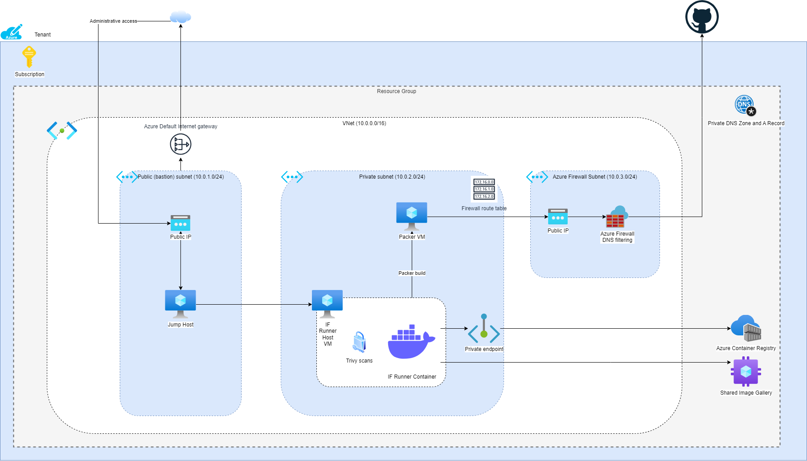

# Terraform documentation

This repository contains terraform code that deploys following platform on Azure:


## Requirements

- Access to Azure Resource Manager
- `terraform >=1.0.0`, tested with `1.9.5`
- Azure CLI, tested with `2.64.0`
- Azure credentials saved as environment variables:

    ```
    export AZURE_CLIENT_ID=
    export AZURE_CLIENT_SECRET=
    export AZURE_TENANT_ID=
    export AZURE_SUBSCRIPTION_ID=
    export GITHUB_OWNER= 
    export GITHUB_TOKEN
    ```


## Usage

If starting from scratch and have no suitable backend for storing the terraform state, use terraform-init to deploy an Azure Storage account and container to use for storing the state.

## terraform-init

This module is intended for running locally, clone the repository and follow the steps:

```
cd terraform-init
terraform init
vim .auto.tfvars # override default variables (variables.tf) to your liking 

# Login into Azure
# Personal account, a popup will open for authentication
az login 

# Service Principal
az login --service-principal -u $AZURE_CLIENT_ID -p AZURE_CLIENT_SECRET --tenant AZURE_TENANT_ID

# Select subscription
az account set --subscription $AZURE_SUBSCRIPTION_ID

# Validate all input variables are set
terraform validate

# Terraform plan and apply
terraform plan # review plan
terraform apply
```

Save the terraform run output for configuring the state backend in the next step

Example output

```
resource_group_name = "wp10dev2-state-rg"
state_container_name = "tfstate"
state_storage_account_name = "tfstateqsc5p"
```

## terraform

This directory contains the main terraform code used to deploy the infrastructure. Easiest way to deploy all the infrastructure using the terraform.yml Actions Workflow:

Edit `config.azurerm.tfbackend` backend cofniguration file with output from `terraform-init`.

### Deploying using Terraform Actions Workflow

Push updated `config.azurerm.tfbackend` file to the repository.

Run the workflow:

- Branch: `main`
- Directory: `terraform` (`terraform-init` deployment is not in function)
- Action: `plan` (to review the changes; once ready, run with `apply` )
- module: `all` (can be used to individually destroy or deploy modules)

### Deploying from local CLI

Login to Azure and select subscription (see above under `terraform-init`)

```
# Change into main terraform directory 
cd terraform

# Prepare environment variables
export GITHUB_OWNER=example-org # owner of the repository where the secrets will be pushed
export GITHUB_TOKEN=1234 # GitHub PAT used to authenticate. Needs admin:public_key:read:public_ley permissions

# Setup pip modules needed for storing secrets in GitHub
python -m venv venv
source venv/bin/activate # venv/Scripts/activate on Windows
pip install -r requirements.txt

# Source helper scripts
source scripts/helper.sh

# Get ARM Storage access key for accessing the state
export RESOURCE_GROUP_NAME=$(extract_value "resource_group_name" config.azurerm.tfbackend)
export STORAGE_ACCOUNT_NAME=$(extract_value "storage_account_name" config.azurerm.tfbackend)
export ARM_ACCESS_KEY=$(az storage account keys list --resource-group $RESOURCE_GROUP_NAME --account-name $STORAGE_ACCOUNT_NAME --query '[0].value' -o tsv)

# Select terraform workspace
terraform workspace list
terraform workspace select --or-create ${{github.event.inputs.workspace}}
terraform workspace list

# Configure terraform state backend
terraform init --backend-config=config.azurerm.tfbackend

# Validate all input variables are set
terraform validate

# Run plan and apply
terraform plan
terraform apply

# To destroy everything
terraform destroy
```